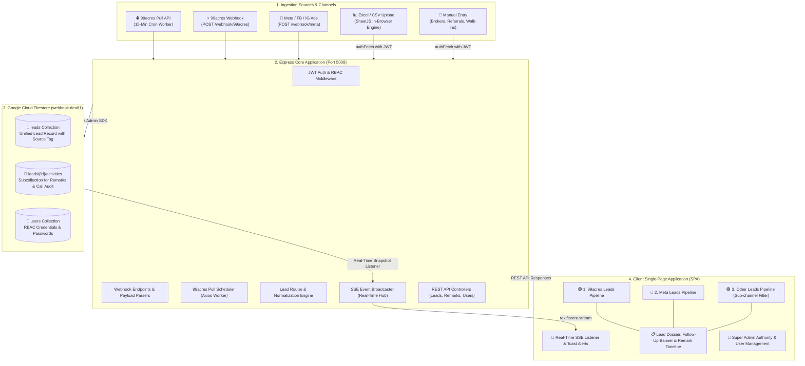
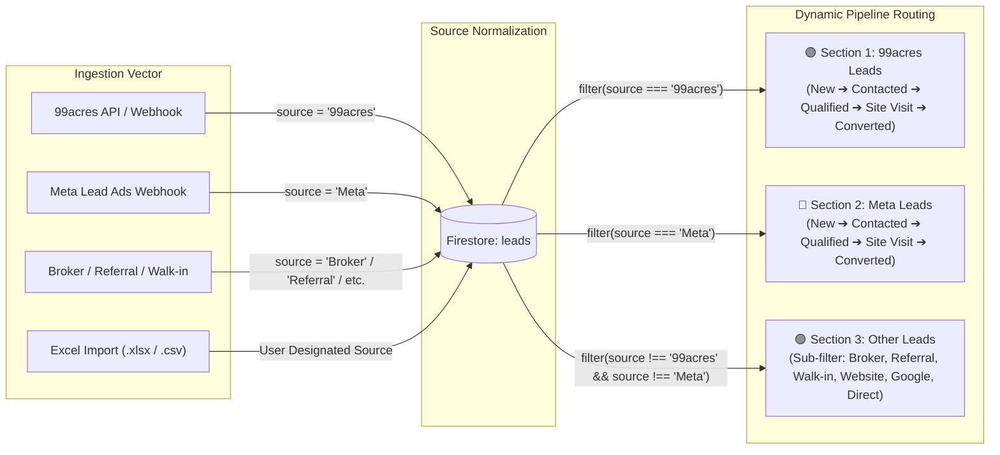

# 💎 Horizon Realty — Real-Time Real Estate CRM & Lead Ingestion Engine

An enterprise-grade, real-time Real Estate CRM and multi-channel lead ingestion engine engineered for **Horizon Realty**. Built on **Node.js/Express**, **Cloud Firestore**, **Server-Sent Events (SSE)**, and **SheetJS**, providing real-time pipeline management, automated 99acres & Meta integrations, Excel/CSV bulk parsing, interaction audit tracking, and role-based authority control.

---

## 🏛️ High-Level System Architecture



---

## 🔄 Multi-Source Lead Routing & Pipeline Architecture

All leads across all sources are ingested into a **single, normalized Firestore collection (`leads`)** with standardized schema attributes. The CRM dynamically separates and projects these leads into **3 dedicated source pipelines**:



---

## ⚡ Real-Time SSE & Remark History Architecture

The CRM maintains continuous, bidirectional awareness between field sales agents and management:

```sequenceDiagram
    autonumber
    actor Advisor as Sales Advisor / Admin
    participant UI as CRM Web Dashboard
    participant Server as Express Server (Port 5000)
    participant Firestore as Cloud Firestore (webhook-dea61)
    participant ClientSSE as Active Advisor Browsers

    Advisor->>UI: Submit Call Remark & Next Callback (e.g. Tomorrow 11 AM)
    UI->>Server: POST /api/leads/:id/remark (Bearer JWT)
    Server->>Firestore: 1. Add doc to leads/{id}/activities
    Server->>Firestore: 2. Update parent lead: lastRemark, nextCallDate, nextCallTime
    Firestore-->>Server: onSnapshot() trigger
    Server-->>ClientSSE: SSE Push (event: remark_added / lead_updated)
    ClientSSE->>UI: Live Re-render: Kanban ⏰ Next Call badge & Dossier timeline update
    UI-->>Advisor: Success toast alert & audio chime
```

---

## 🌟 Core Modules & Capabilities

### 1. 🟢 Section 1: 99acres Leads Pipeline
- **Automated Pull API**: Embedded background worker queries 99acres every 15 minutes (`https://www.99acres.com/99api/v1/getmydata/`) with XML payload transformation.
- **Webhook Ingestion**: Real-time webhook listener at `POST /webhook/99acres` for instant property portal push.
- **Automatic Segregation**: All 99acres inquiries automatically route to Section 1 without manual movement.

### 2. 🔵 Section 2: Meta Leads Pipeline
- **Meta Webhook Endpoints**: Built-in verification challenge & lead capture handlers at `/webhook/meta` and `/webhook/facebook`.
- **Targeted Campaign Routing**: Direct routing for Facebook & Instagram lead ad campaigns.

### 3. 🟣 Section 3: Other Ingestion Channels
- **Multi-Source Sub-Filters**: Instant tab chips to filter across `All Others`, `Broker`, `Referral`, `Walk-in`, `Website`, `Google`, and `Direct`.
- **Comprehensive Channel Management**: Centralized hub for ground teams, channel partners, and direct web inquiries.

### 4. 📊 In-Browser Excel & CSV Import Engine
- **Supported Formats**: `.xlsx`, `.xls`, and `.csv` parsed client-side using **SheetJS**.
- **Interactive Source Attribution**: Prompts the user to tag the incoming batch with its true source (`99acres`, `Meta`, `Broker`, `Referral`, `Walk-in`, `Website`, `Google Ads`, `Other`).
- **Live Preview Table**: Displays a 5-row table preview before executing batch insertion.
- **Bulk Ingestion Endpoint**: Dispatches to `POST /api/leads/import-bulk` with automatic audit history generation.

### 5. ⏰ Next Callback Scheduling & Interaction History
- **Follow-up Presets**: Rapidly schedule calls (*Today 6 PM*, *Tomorrow 11 AM*, *In 2 Days 4 PM*, or Custom Date/Time).
- **Follow-up Banner**: Prominent golden alert inside the Lead Dossier with a 1-click **"Mark Called"** completion action.
- **Audit Subcollection**: Chronological timeline storing agent name, timestamp, interaction type, and customer feedback under `leads/{id}/activities`.

### 6. 👑 Super Admin God-Mode & RBAC
- **Authority Levels**:
  - `SUPER_ADMIN` (Full control: manage users, view all leads, reset passwords, change roles)
  - `SENIOR_ADVISOR` / `ADVISOR` (Pipeline management, calling, remark entry)
- **User Management**: Enroll new advisors by name and phone, assign roles, and execute instant password resets.

---

## 📂 Project Directory Structure

```
realtime-estate-crm/
├── service-account.json             # Firebase Admin Service Account Key
├── .env                             # Environment variables & API credentials
├── .env.example                     # Sample configuration template
├── package.json                     # Node.js dependencies & scripts
├── src/
│   ├── config/
│   │   └── firebase.js              # Firestore Admin SDK initialization
│   ├── routes/
│   │   ├── auth.js                  # Authentication (JWT login, me, RBAC)
│   │   ├── leads.js                 # Leads REST API, SSE real-time stream, bulk import
│   │   ├── users.js                 # User management & password reset API
│   │   └── webhooks.js              # 99acres & Meta webhook endpoints
│   ├── services/
│   │   └── acresPoller.js           # 15-minute 99acres Pull API background worker
│   └── server.js                    # Express application bootstrap & route mounting
├── public/
│   ├── index.html                   # Single-Page Application UI & Modals
│   ├── app.js                       # Frontend state, SSE client, SheetJS parser, UI actions
│   └── styles.css                   # Horizon Realty luxury theme styling
└── scripts/
    ├── seedSuperAdmin.js            # Super Admin bootstrap script
    └── testPollerManual.js          # 99acres API connectivity test utility
```

---

## 🗄️ Firestore Database Schema

### 1. `leads` Collection (Root Document)
```json
{
  "id": "autogenerated_id",
  "name": "Rajesh Sharma",
  "phone": "+919876543210",
  "email": "rajesh@example.com",
  "project": "Horizon Reserve - 3BHK",
  "budget": "₹1.5 - 2 Cr",
  "source": "99acres",
  "stage": "New",
  "inquiryId": "99A-1788499200",
  "query": "Interested in 3BHK Luxury Tower A",
  "lastRemark": "Customer requested callback tomorrow morning",
  "nextCallDate": "2026-09-05",
  "nextCallTime": "11:00 AM",
  "nextCallReason": "Price / Budget Discussion",
  "assignedTo": "agent@estate.com",
  "createdAt": "2026-09-04T09:00:00.000Z",
  "updatedAt": "2026-09-04T09:30:00.000Z"
}
```

### 2. `leads/{id}/activities` Subcollection
```json
{
  "id": "autogenerated_activity_id",
  "type": "CALL_LOGGED",
  "title": "Outbound Call Completed",
  "notes": "Discussed 3BHK pricing and payment schedules. Client requested floor plans on WhatsApp.",
  "category": "Price / Budget Discussion",
  "nextCallDate": "2026-09-05",
  "nextCallTime": "11:00 AM",
  "advisorName": "Senior Advisor",
  "advisorEmail": "agent@estate.com",
  "createdAt": "2026-09-04T09:30:00.000Z"
}
```

### 3. `users` Collection
```json
{
  "id": "user_id",
  "name": "Executive Director",
  "email": "superadmin@horizon.com",
  "password": "hashed_or_managed_password",
  "phone": "+919811002233",
  "role": "SUPER_ADMIN",
  "createdAt": "2026-09-04T00:00:00.000Z"
}
```

---

## 📡 API Endpoint Reference

| Method | Endpoint | Authorization | Description |
| :--- | :--- | :--- | :--- |
| `POST` | `/api/auth/login` | Public | Authenticate user & return JWT token |
| `GET` | `/api/auth/me` | Bearer JWT | Fetch current user session & permissions |
| `GET` | `/api/leads` | Bearer JWT | Retrieve all leads (filterable by `source` or `stage`) |
| `POST` | `/api/leads` | Bearer JWT | Create a single lead record |
| `POST` | `/api/leads/import-bulk` | Bearer JWT | Bulk insert spreadsheet leads with source attribution |
| `PATCH` | `/api/leads/:id/stage` | Bearer JWT | Move lead to new Kanban stage |
| `POST` | `/api/leads/:id/remark` | Bearer JWT | Record remark note & schedule next callback |
| `POST` | `/api/leads/:id/call` | Bearer JWT | Log phone call discussion & audit trail |
| `PATCH` | `/api/leads/:id/complete-followup`| Bearer JWT | Mark scheduled callback as completed |
| `GET` | `/api/leads/events` | Query `?token=`| Server-Sent Events (SSE) real-time stream |
| `POST` | `/webhook/99acres` | Webhook Key | Ingest real-time leads from 99acres |
| `POST` | `/webhook/meta` | Webhook Key | Ingest real-time leads from Meta Lead Ads |
| `GET` | `/api/users` | Super Admin | List all registered users |
| `POST` | `/api/users` | Super Admin | Enroll a new advisor or admin |
| `POST` | `/api/users/:id/reset-password` | Super Admin | Reset password for any user |

---

## 🔐 Default Access Credentials

| Authority Level | Executive Email | Security Password | Assigned Role |
| :--- | :--- | :--- | :--- |
| **Super Admin** | `admin@estate.com` | `admin123` | `SUPER_ADMIN` |
| **Executive Director** | `superadmin@horizon.com` | `Horizon@2026` | `SUPER_ADMIN` |
| **Senior Advisor** | `agent@estate.com` | `agent123` | `SENIOR_ADVISOR` |

---

## 🚀 Quickstart & Setup

### 1. Environment Configuration
Ensure your `.env` file contains the required Firestore and integration settings:
```env
PORT=5000
JWT_SECRET=your_jwt_secret_key_here
ACRES_USER_NAME=your_99acres_username
ACRES_PASSWORD=your_99acres_password
ACRES_ENABLE_POLLER=true
ACRES_POLLER_INTERVAL_MINUTES=15
```

### 2. Install Dependencies
```bash
npm install
```

### 3. Launch the Server
```bash
npm start
```

### 4. Access the CRM
Navigate to **`http://localhost:5000`** in any modern web browser.

---

## 🛡️ Security & Compliance
- **Authentication**: Stateless JSON Web Tokens (JWT) signed with HMAC-SHA256.
- **Data Protection**: Firestore security rules enforced with server-side validation.
- **Rate-Limiting**: 99acres 15-minute background poller strictly compliant with the 4-requests/hour limit.# real-time-crm

# real-time-crm

# demo-crm

